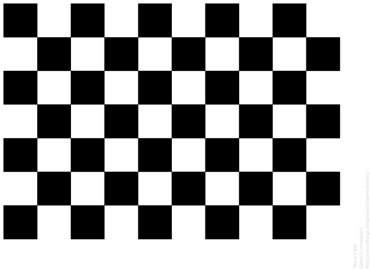

**LaneDetection_Thesis2022-23**

Project Development Plan:
1. Camera Calibration
2. Preprocessing 
3. Bird's Eye View
---
## Camera Calibration
- Prepare 9x6 pattern chessboard for calibration

9x6 chessboard pattern

- Size measure

- Pattern setting (at least 10 scenario)

- ...

For Reference: [OpenCV Camera Calibration Tutorial in Python](https://docs.opencv.org/4.x/dc/dbb/tutorial_py_calibration.html)

## Preprocessing
### ROI
### Road Segmentation

